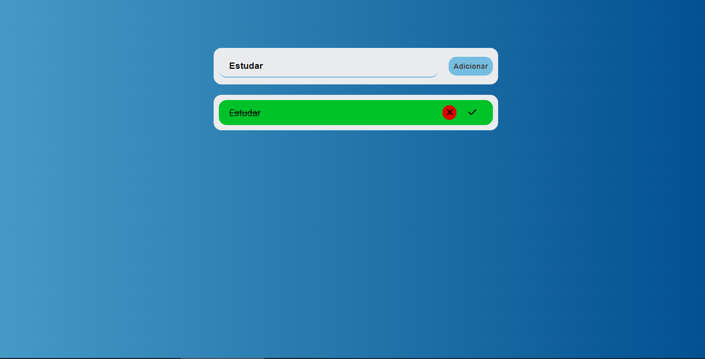

# Projeto Gerenciador-de-Terefas 

## Sobre o projeto:

Gerenciador de tarefa simples, onde você pode adicionar, marcar como concluídas e excluir suas tarefas. 
O intuito desse projeto foi colocar meus conhecimentos em Javascript e manipulação da DOM na pratica.  

[🔗 Clique aqui para acessar](https://AndersonRodrigs.github.io/Gerenciador-de-Terefas/)

## 🛠 Tecnologias:

<!--# Autor:-->
## Contato
 

